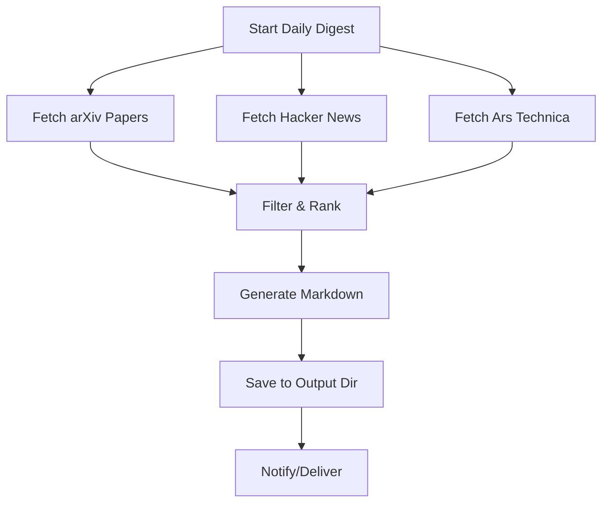

# Multi-Source Daily Digest Generator

## Overview
This skill provides a complete workflow for generating daily news digests from multiple sources (arXiv, Hacker News, Ars Technica, etc.) focused on RAG/AI/ML topics.

## Trigger
Run daily via cron job at configured time (e.g., 6 AM local).

## Workflow



## Step-by-Step Implementation

### 1. Configuration
```python
CONFIG = {
    "output_dir": "C:/Users/valte/RAG-lecture",
    "date_format": "%Y-%m-%d",
    "arxiv": {
        "max_results": 30,
        "sort_by": "submittedDate",
        "sort_order": "descending",
        "query": 'all:"retrieval augmented generation" OR all:RAG OR all:"vector database" OR all:"graph RAG" OR all:"dense retrieval" OR all:reranking OR all:faiss OR all:milvus OR all:weaviate OR all:pinecone OR all:qdrant OR all:chromadb'
    },
    "hacker_news": {
        "query": "RAG OR \"retrieval augmented generation\" OR \"vector database\"",
        "tags": "story",
        "hits_per_page": 20
    },
    "ars_technica": {
        "feeds": ["https://arstechnica.com/ai/feed/", "https://arstechnica.com/feed/"],
        "keywords": ["ai", "ml", "machine learning", "llm", "rag", "retrieval", "vector", "neural", "gpt", "llama", "openai", "anthropic", "transformer", "generative", "embedding", "semantic search"],
        "max_items": 15
    },
    "output": {
        "filename_template": "RAG_News_Digest_{date}.md",
        "sections": ["arxiv", "hacker_news", "ars_technica"]
    }
}
```

### 2. arXiv Fetcher
```python
def fetch_arxiv(config):
    import requests, xml.etree.ElementTree as ET
    from defusedxml.ElementTree import fromstring
    
    url = "http://export.arxiv.org/api/query"
    params = {
        "search_query": config["arxiv"]["query"],
        "start": 0,
        "max_results": config["arxiv"]["max_results"],
        "sortBy": config["arxiv"]["sort_by"],
        "sortOrder": config["arxiv"]["sort_order"]
    }
    resp = requests.get(url, params=params, timeout=30)
    root = fromstring(resp.content)
    ns = {"atom": "http://www.w3.org/2005/Atom"}
    
    papers = []
    for entry in root.findall("atom:entry", ns):
        title = entry.find("atom:title", ns).text.strip().replace("\n", " ")
        link = entry.find("atom:link[@rel='alternate']", ns).get("href")
        summary = entry.find("atom:summary", ns).text.strip().replace("\n", " ")
        published = entry.find("atom:published", ns).text[:10]
        authors = [a.find("atom:name", ns).text for a in entry.findall("atom:author", ns)]
        
        # Secondary filter - ensure RAG relevance
        text = (title + " " + summary).lower()
        rag_keywords = ["rag", "retrieval augmented", "retrieval-augmented", "vector database", "vector store", 
                       "graph rag", "dense retrieval", "rerank", "faiss", "milvus", "pinecone", "weaviate",
                       "qdrant", "chroma", "lancedb", "embedding", "semantic search"]
        if any(kw in text for kw in rag_keywords):
            papers.append({
                "title": title, "link": link, "summary": summary[:500],
                "published": published, "authors": ", ".join(authors[:3])
            })
    
    return papers[:20]  # Top 20
```

### 3. Hacker News Fetcher
```python
def fetch_hacker_news(config):
    import requests
    from datetime import datetime, timedelta
    
    url = "https://hn.algolia.com/api/v1/search"
    params = {
        "query": config["hacker_news"]["query"],
        "tags": config["hacker_news"]["tags"],
        "hitsPerPage": config["hacker_news"]["hits_per_page"]
    }
    resp = requests.get(url, params=params, timeout=30)
    data = resp.json()
    
    stories = []
    for hit in data.get("hits", []):
        if hit.get("url"):  # Only stories with links
            stories.append({
                "title": hit["title"],
                "url": hit["url"],
                "points": hit["points"],
                "author": hit["author"],
                "created_at": datetime.fromtimestamp(hit["created_at_i"]).strftime("%Y-%m-%d")
            })
    
    return stories[:15]
```

### 4. Ars Technica Fetcher
```python
def fetch_ars_technica(config):
    import requests
    from defusedxml.ElementTree import fromstring
    from email.utils import parsedate_to_datetime
    
    ns = {"content": "http://purl.org/rss/1.0/modules/content/"}
    keywords = [k.lower() for k in config["ars_technica"]["keywords"]]
    seen_links = set()
    all_items = []
    
    for feed_url in config["ars_technica"]["feeds"]:
        resp = requests.get(feed_url, timeout=30)
        root = fromstring(resp.content)
        
        for item in root.findall(".//item")[:config["ars_technica"]["max_items"]]:
            title = item.find("title").text if item.find("title") is not None else ""
            link = item.find("link").text if item.find("link") is not None else ""
            pub_date = item.find("pubDate").text if item.find("pubDate") is not None else ""
            desc = item.find("description").text if item.find("description") is not None else ""
            content = item.find("content:encoded", ns)
            content_text = content.text if content is not None else ""
            
            if link in seen_links:
                continue
            seen_links.add(link)
            
            # Keyword filter
            full_text = (title + " " + desc + " " + content_text).lower()
            if not any(kw in full_text for kw in keywords):
                continue
            
            all_items.append({
                "title": title,
                "link": link,
                "pubDate": pub_date,
                "description": desc[:300]
            })
    
    return all_items[:10]
```

### 5. Markdown Generator
```python
def generate_digest(papers, stories, articles, date_str, output_path):
    with open(output_path, "w", encoding="utf-8") as f:
        f.write(f"# RAG News Digest - {date_str}\n\n")
        f.write(f"Generated: {datetime.now().isoformat()}\n\n")
        
        # arXiv section
        f.write("## arXiv Latest Papers (RAG/Vector DB/Graph RAG related)\n\n")
        for p in papers:
            f.write(f"### {p['title']}\n")
            f.write(f"**Authors:** {p['authors']}  \n")
            f.write(f"**Published:** {p['published']}  \n")
            f.write(f"**Link:** {p['link']}  \n")
            f.write(f"**Abstract:** {p['summary']}...  \n\n")
        
        # Hacker News section
        f.write("## Hacker News (RAG/Vector DB related)\n\n")
        for s in stories:
            f.write(f"- [{s['title']}]({s['url']}) ({s['points']} points, by {s['author']})  \n")
        
        # Ars Technica section
        f.write("\n## Ars Technica (AI/ML/RAG related)\n\n")
        for a in articles:
            f.write(f"- [{a['title']}]({a['link']}) ({a['pubDate']})\n")
            f.write(f"  {a['description']}...\n\n")
        
        f.write("\n---\n*End of RAG News Digest*\n")
```

### 6. Main Orchestrator
```python
def main():
    from datetime import datetime
    import os
    
    date_str = datetime.now().strftime(CONFIG["date_format"])
    output_file = os.path.join(
        CONFIG["output_dir"],
        CONFIG["output"]["filename_template"].format(date=date_str)
    )
    
    os.makedirs(CONFIG["output_dir"], exist_ok=True)
    
    # Fetch all sources
    papers = fetch_arxiv(CONFIG)
    stories = fetch_hacker_news(CONFIG)
    articles = fetch_ars_technica(CONFIG)
    
    # Generate
    generate_digest(papers, stories, articles, date_str, output_file)
    
    print(f"Written to {output_file}")
    return output_file

if __name__ == "__main__":
    main()
```

## Dependencies
```
requests
defusedxml
python-dateutil  # for parsedate_to_datetime
```

## Cron Setup (Hermes)
```yaml
# ~/.hermes/cron/daily-rag-digest.yaml
name: daily-rag-digest
schedule: "0 6 * * *"  # 6 AM daily
command: python C:/path/to/digest_generator.py
notify_on_failure: true
```

## Error Handling
- Wrap each fetcher in try/except; log errors but continue
- Timeout: 30s per request
- Retry: 2x with exponential backoff for transient failures
- If all sources fail, alert; if partial, generate with available data

## Testing
```bash
# Dry run
python digest_generator.py --dry-run

# Test specific source
python -c "from digest_generator import fetch_arxiv; print(fetch_arxiv(CONFIG)[:3])"
```